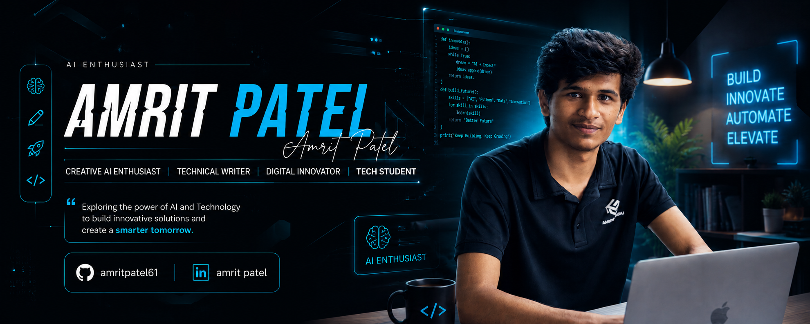

<p align="center">
  
</p>

<h1 align="center">Pranam👋, It's me Amrit Patel</h1>

<h3 align="center">
🤖 AI Enthusiast • ✍️ Technical Writer • 🚀 Digital Innovator • 🎓 BSc CSIT Student
</h3>

<p align="center">

</p>

<p align="center">
  
</p>

---

## 🚀 About Me

🎓 BSc CSIT Student from Nepal

🤖 Passionate about Artificial Intelligence and Emerging Technologies

💡 Exploring how AI can transform businesses and everyday life

✍️ Technical Writer who enjoys sharing knowledge

🚀 Digital Innovator focused on solving real-world problems

🌱 Currently learning AI Tools, Data Analysis, Modern Technologies and Cyber Security 

🎯 Mission: Build impactful AI-powered solutions that create value for people and businesses.

---

## 📊 GitHub Stats

<p align="center">
  
  
</p>

---

## 📈 Contribution Activity

<p align="center">
  
</p>

---

## 🏆 GitHub Achievements

<p align="center">
  
</p>

---

## 🌐 Connect With Me

<p align="center">

<a href="https://github.com/amritpatel61">

</a>

  

<a href="https://www.linkedin.com/in/amrit-patel-0b378336a/">

</a>

</p>

---

## 💭 Current Mindset

```bash
> whoami

Amrit Patel

> interests

Artificial Intelligence
Technology
Innovation
Business Solutions
Cyber Security
Technical Writing

> mission

Build.
Learn.
Innovate.
Repeat.
```

---

## 🚀 Quote

> "Exploring the power of AI and technology to build innovative solutions and create a smarter tomorrow."

---

<p align="center">
⚡ Building The Future With ... ⚡
</p>

<p align="center">
Thanks for visiting my profile ⭐
</p>
